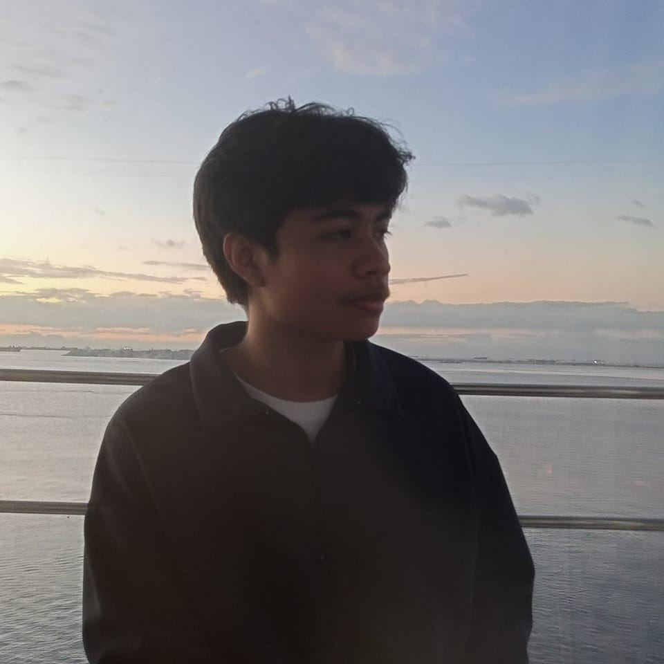

<table>
  <tr>
    <td width="20%" align="center">
      
    </td>
    <td width="70%" valign="top">
      <h1 align="left"> Welcome to My GitHub || Russel Lopez </h1>
  

    I'm a passionate college student exploring the world of programming and technology.
    I enjoy the challenges that programming gives me, coming up with solutions and to keep expanding my knowledge every day.
    Technology evolves faster than we can anticipate, and my dream is to be part of shaping that change. 
  

    </td>
  </tr>
</table>

<h2>🛠️ Skills</h2>

<b>Interests:</b>  Web Applications, Game Development, App Development, Web Development

<b>Languages:</b>

  
  
  
  
  
  

<h2>📂 Projects</h2>

This is where my projects will appear:

<ul>
  <li>✏️ <a href="https://docs.google.com/document/d/1UMktg7OaThhe2K-ZC4P_wr9I7Zrnjd1Xf41AuldWXvA/edit?usp=sharing">Project 0 - Midterm Paired Task 1</a></li>
  <li>✏️ <a href="https://docs.google.com/document/d/1o-xWUObE9C5o1FTpFi87XN3bE9Zm3JcQQZrWKbiojm8/edit?usp=sharing">Project 1 - Midterm Lab Task 1 Getting started with Python</a></li>
  <li>✏️ <a href="https://docs.google.com/document/d/1JdzIEdLT3SnoZj2yktz9NQuIK9h8lipcTArakrSigA8/edit?usp=sharing">Project 2 - Midterm Lab Task 2 Loop Construct</a></li>
  <li>✏️ <a href="https://docs.google.com/document/d/1CkfzIstDXd1jnWyImPl_cdOd_NcUvsKB/edit?usp=sharing&ouid=114309544275202004213&rtpof=true&sd=true">Project 3 - Midterm Lab Task 3. Using List Collections</a></li>
  <li>✏️ <a href="https://docs.google.com/document/d/1vqu-KfFE89QTYoCS9eXQh-2bbqQrjjZc6R1tp_4PpzI/edit?usp=sharing">Project 4 - Midterm Lab Task 4. Using Dictionary Collections</a></li>
  <li>✏️ <a href="https://docs.google.com/document/d/1izl64Km_WkdQCXZyMTVIzTu8wcY5c_Q_8A-7T3MgJYI/edit?usp=sharing">Project 5 - Midterm Lab Task 5. Creating and Instantiating Classes</a></li>
  <li>✏️ <a href="https://docs.google.com/document/d/1O__n-WplqWYtw20_fgp1mHkj50q6bSJltOqcXiqU6b0/edit?usp=sharing">Project 6 - Midterm Lab Task 6. Overloaded Consturctors</a></li>
  <li>✏️ <a href="https://docs.google.com/document/d/1ktgmPtT8zKSfF8cLolLG3iwN4e2AJpb8cDq88fKe634/edit?usp=sharing">Project 7 - Finals Lab Task 1. Encapsulation</a></li>
  <li>✏️ <a href="https://docs.google.com/document/d/1cvYJB0Ap6LmU2EzxN9RWJCjbaOsGhw7plzBshOUOQcE/edit?usp=sharing">Project 8 - Finals Task 2. Inheritance</a></li>
  <li>✏️ <a href="https://docs.google.com/document/d/1hhRJ9UIDh9MMO317dcRj9MXmUj7n7LiOMLCZfzsXU3A/edit?usp=sharing">Project 9 - Finals Task 3. Polymorphism</a></li>
  <li>✏️ <a href="https://docs.google.com/document/d/1Dl_V2LJy1YIYrGuwhaVfc5k4EVzouecgCCf3IpjAWxo/edit?usp=sharing">Project 10 - Finals task 4. Designing Tkinter GUI using OOP</a></li>
  <li>✏️ <a href="https://docs.google.com/document/d/1scKKvp00dHA3I3e-nGFspT-JHsMvRxlFyvW7SJLO1is/edit?usp=sharing">Project 11 - Finals Task 5. Grading Program using Tkinter</a></li>
  <li>✏️ <a href="https://docs.google.com/document/d/13SKNwcs4b55gtBtHKCrf5ylBqEcG6UnfJ3kEs3gu72E/edit?usp=sharing">Project 12 - Finals Lab Task 6. Mysql and Pythod CRUD using CLI</a></li>
  <li>✏️ <a href="https://docs.google.com/document/d/1K4wHilqke5w0GFzrzvpGkLjkxSQ4wLNnq1mKgO99Onc/edit?usp=sharing">Project 13 - Finals Task 7. Tkinter CRUD GUI</a></li>
</ul>

<h2>🎉 Fun Facts About Me</h2>
<ul>
  <li>📚 I love reading <b>manhwa, manga, and manhua</b>.</li>
  <li>🍳 I'm good at <b>cleaning and cooking</b>.</li>
  <li>✋ I still like <b>her</b>.</li>
</ul>

<h2>📬 Connect with Me</h2>

  
  

